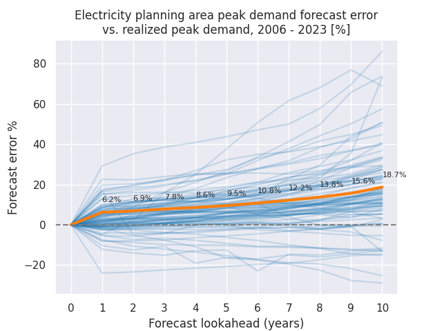

#+title: PUDL Issue 3910

This repository contains my attempts at helping out with [[https://github.com/catalyst-cooperative/pudl/issues/3910][Issue 3910]] in the PUDL
repo.

* Reproducing the squid plot
Alex Engel has a nice "squid" plot visualizing the bias of FERC714
correspondents towards overestimating future demand. I've followed his provided
code and reproduced it here to get a better understanding of the data.

See the notebook [[file:squid.org][here]] to see my version of the code (it's very close to being
identical, other than being written using polars instead of pandas).
